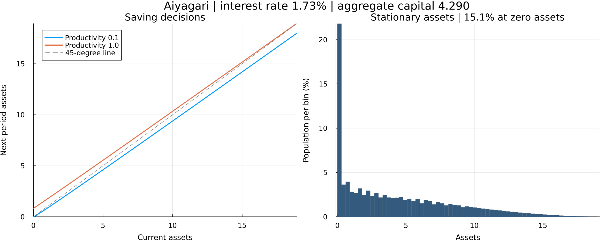

# Aiyagari: learning and computation

Two Julia implementations of a stationary production economy with uninsured
idiosyncratic productivity risk:

| Start here | Method | Default policy / distribution nodes |
|---|---|---:|
| [Illustrative](Aiyagari_illustrative.jl) | Value function iteration, scalar maximization, explicit Young transport | 250 / 1,500 |
| [Efficient](Aiyagari_efficient.jl) | Endogenous grid method, sparse Young transition, warm starts | 800 / 5,000 |

Both solve the same model. The efficient file imports the illustrative file's
parameters, firms' prices, grid helpers, and market-clearing search. These
replace the previous three discrete-time scripts, including the incomplete
attempt. The separate continuous-time folder is unchanged.

## Run

Dependencies: `Interpolations`, `Optim`, and `Plots`. With those installed in
your Julia environment, run either command from this folder:

```text
julia Aiyagari_illustrative.jl
julia Aiyagari_efficient.jl
```

The illustrative version prints the equilibrium. The efficient version also
regenerates **`aiyagari.png`**, the only figure retained here. Both scripts
can be called by full path from another directory.

## Model and calibration

Households have log utility, `beta=0.96`, and budget
`c + a_next = w*z + (1+r)*a`, with no borrowing. The original productivity
states `[0.1, 1.0]` and transition matrix `[0.95 0.05; 0.1 0.9]` are retained.
Their stationary probabilities are `[2/3, 1/3]`.

Production is `Y = K^0.33 * L^0.67` with depreciation `0.05`.
**Aggregate effective labor is 0.4**, calculated from the productivity
distribution rather than assumed to be one. At each proposed interest rate,
the firm's first-order conditions determine the wage and capital demand;
the rate adjusts until household assets equal that demand. There are no
aggregate shocks. This is an illustrative calibration, not a replication of
every numerical result in Aiyagari (1994).

The asset ceiling is 30. Curved policy and distribution grids put more points
near zero. All grid sizes are parameters, not hard-coded array slices.

## Algorithms and figure

The illustrative version implements the Bellman problem directly. EGM uses
`u'(c) = beta*(1+r)*E[u'(c_next)]` to recover consumption and today's endogenous
asset grid. Both versions transport the distribution with Young's two-node
interpolation weights and today's productivity policy. The efficient solver
stores these probabilities in a sparse transition matrix and reuses previous
solutions during the interest-rate search. No large state/action/state tensor
or simulated panel is needed to compute equilibrium.



This figure uses the efficient defaults. Bars are probabilities in bins of
width 0.3. The first bin includes the zero-asset atom, whose approximate share
is stated separately in the title. The plotted range ends near the 99.99th
asset percentile; the grid itself extends to 30. The two-state productivity
process can still produce small bumps in the distribution.

## Numerical checks

At the efficient defaults, the net interest rate is approximately **1.7326%
per period**, aggregate capital is **4.28952**, and the wage is **1.46585**.
The capital-market gap is about `2.0e-6` and roughly **15.07%** of households
are at zero assets. Doubling both grids changes the rate by less than `1e-6`.
No mass reaches the upper grid endpoint.

Probability, productivity marginals, goods and capital-market clearing,
Euler/KKT conditions, and an independent simulation were checked. The
distribution-weighted relative Euler residual is about `2.0e-6`; the maximum
interior residual is about `0.0010`. For a fixed policy, the explicit and
sparse distribution calculations agree to numerical tolerance.

On identical 250 / 1,500 grids, a warm run excluding compilation and plotting
took approximately **4.05 s** for VFI and **0.075 s** for the efficient version
(about **54x faster**). Interest rates differed by about `2.3e-6`. Timings are
machine-dependent; the default efficient figure uses finer grids.
Tested with Julia 1.12.2, Interpolations 0.16.2, Optim 1.13.3, and Plots 1.41.3.

## References

- [Aiyagari (1994)](https://doi.org/10.2307/2118417), the production economy.
- [Carroll (2006)](https://doi.org/10.1016/j.econlet.2005.09.013), endogenous grids.
- [Young (2010)](https://doi.org/10.1016/j.jedc.2008.11.010), non-stochastic distribution transport.
- The earlier examples drew on [QuantEcon's Aiyagari lecture](https://julia.quantecon.org/multi_agent_models/aiyagari.html).
