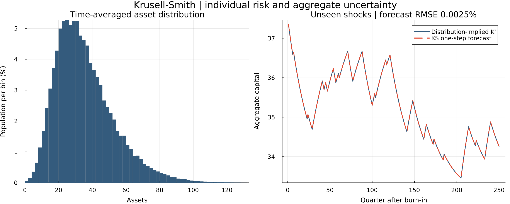

# Krusell-Smith: individual risk and aggregate uncertainty

Two Julia implementations of the same approximate-aggregation exercise:

| Start here | Household / distribution method | Default grids: assets / distribution / aggregate capital |
|---|---|---:|
| [Illustrative](KrusellSmith_illustrative.jl) | Value-function iteration, scalar maximization, explicit Young transport | 70 / 500 / 5 |
| [Efficient](KrusellSmith_efficient.jl) | Endogenous grids, cached interpolation, in-place Young transport | 180 / 1,000 / 9 |

The efficient script imports the illustrative script's calibration, prices,
regression, and outer equilibrium loop. The files live together; they are not
two unrelated implementations of different economies. Only the efficient
script produces **`krusell-smith.png`**, the single figure retained here.

## Run

Dependencies: `Optim` and `Plots`, plus Julia's standard libraries. Install
the packages once in your Julia environment, then run either script:

```julia
using Pkg
Pkg.add(["Optim", "Plots"])
```

```text
julia KrusellSmith_illustrative.jl
julia KrusellSmith_efficient.jl
```

Both can also be run by full path from another directory. Tested with Julia
1.12.2, Optim 1.13.3, and Plots 1.41.3. Neither script needs multiple threads.

## What changes relative to Aiyagari?

Aggregate productivity now switches between bad and good times. Households
observe their assets `a`, employment `e`, aggregate capital `K`, and aggregate
state `z`. They would ideally track the entire wealth distribution. Instead,
the Krusell-Smith algorithm summarizes it by its mean and guesses

```text
log(K_next) = B[z,1] + B[z,2] * log(K).
```

The algorithm is:

1. Guess the two forecasting rules (one per aggregate state).
2. Solve households' saving decisions under those rules.
3. Simulate aggregate shocks and evolve the whole asset/employment distribution.
   Actual capital is the distribution's mean, not the guessed forecast.
4. Regress actual next-period log capital on current log capital, separately
   for each current aggregate state.
5. Dampen the coefficient update and repeat until the gap is below `2e-5`.

Both versions use the same fixed aggregate shock sequence across iterations.
The returned coefficients are the ones used to solve the returned household
problem, not an additional update that households have not yet used.
Grid bounds are checked: aggregate capital and its forecasts are never
silently clipped to make the iteration appear to converge.

## Teaching calibration

Households have log utility, a common `beta=0.99`, no borrowing, and budget

```text
c + a_next = R(K,z)*a + income(e,K,z).
Y = z * K^0.36 * L(z)^0.64; depreciation = 0.025.
R = 1 - depreciation + marginal product of capital.
```

Aggregate productivity is `[0.99, 1.01]`, unemployment is `[0.10, 0.04]`,
and an aggregate state persists with probability `0.875`. Employed households
work one unit, so `L(z)=1-unemployment(z)`. Unemployed households receive
`0.15*wage`; a proportional labor-income tax balances this transfer each
period. This ensures positive income even at zero assets while preserving
the aggregate resource constraint.

This is a **teaching variant**, not an exact replication of all the numerical
results in Krusell and Smith (1998): it uses a common discount factor, unit
hours, and balanced-budget unemployment benefits. It does not attempt to
match the empirical wealth distribution or reproduce the paper's
heterogeneous-discount-factor extension.

Employment transition probabilities are constructed without rounded joint
probabilities. Their conditional matrices obey

```text
[u(z), 1-u(z)] * Pe[:,:,z,z_next] = [u(z_next), 1-u(z_next)].
```

The household expectation weights future states by `Pz[z,z_next] * Pe[...]`.
Once the aggregate shock is realized, distribution transport uses **only
the conditional employment matrix**. Multiplying by the joint probability
again would incorrectly destroy population mass.

## Numerical methods

The illustrative Bellman solver uses continuous scalar maximization with
linear interpolation. Ten fixed-policy evaluation steps between maximizations
(Howard steps) keep this version reasonably quick. Its household grid is
deliberately modest for readability and runtime, not research-grade accuracy.

The efficient solver uses the Euler equation
`1/c = beta * E[R_next/c_next]` to construct an endogenous asset grid. It
integrates over both future aggregate and individual shocks. Consumption and
future prices are evaluated at the perceived next-period capital stock.

Both versions use Young's non-stochastic distribution method: place each
household's saving between adjacent asset nodes, split its mass using linear
weights, and distribute that mass across employment states. Aggregate shocks
are simulated; individual shocks are integrated out. The efficient version
caches asset-grid interpolation and reuses arrays. A fixed stationary
transition matrix is not reused, because capital and saving policies change
over time. No huge panel of simulated individuals is needed.

## One figure, two views



The figure comes from a **new aggregate shock sequence**, not the sequence
used to estimate the law. With the efficient defaults, the simulation has
6,000 quarters and discards the first 1,000. The illustrative defaults use
2,400 quarters and discard 400.

- **Left:** the asset distribution averaged over all post-burn-in quarters.
  It is not an invariant distribution conditional on a fixed aggregate state.
  Bars show population probabilities in bins of width 2; the first includes
  zero assets. The displayed range ends near the 99.99th asset percentile;
  the computational grid extends to 200.
- **Right:** 250 post-burn-in quarters of distribution-implied `K_next` and
  the one-step forecast using actual `K`. Their near overlap illustrates
  approximate aggregation. This is not a recursively forecast path.

## Checks and limitations

At the efficient defaults (seed 1998), the fitted law is approximately

```text
Bad:  log(K_next) = 0.12007 + 0.96562 * log(K)
Good: log(K_next) = 0.13429 + 0.96314 * log(K).
```

Average post-burn-in capital is **35.4725**. The coefficient loop converges
in 20 iterations. Forty numerical checks cover probability conservation,
employment shares, positive consumption, asset bounds, the government and
aggregate resource constraints, both transport implementations, Euler/KKT
conditions, grid sensitivity, and agreement between the complete solvers.

The largest relative interior Euler residual on the household grid is about
`8.6e-4` (mean `1.1e-5`). Population/employment errors are below `2e-13`, and
negligible mass reaches the asset ceiling (less than `1e-14`).

On the new shock sequence, one-step capital forecast RMSE is about **0.0025%**
and the maximum error is **0.0117%**. A recursively forecast capital sequence
has RMSE around **0.055%** and maximum error **0.178%**. High regression R²
alone is not an accuracy certificate: the moment restriction, grid size,
interpolation, simulation length, and shock realization all matter.

Refining to 360 / 2,000 / 17 nodes changes mean capital by **−0.12%**.
On identical illustrative grids, VFI and EGM differ in mean capital by about
**0.33%**, reflecting their different numerical approximations. Both solve
the same economic model; their coarse-grid answers are not numerically exact.
In one local run, the complete coarse-grid VFI solve took about 25 seconds
versus 1.2 seconds for EGM, excluding package loading and plotting; timings
are machine-dependent and include some first-call compilation.

## References

- [Krusell and Smith (1998)](https://doi.org/10.1086/250034): approximate aggregation.
- [Carroll (2006)](https://doi.org/10.1016/j.econlet.2005.09.013): endogenous grids.
- [Young (2010)](https://doi.org/10.1016/j.jedc.2008.11.010): non-stochastic distribution transport.
- [GDSGE's Krusell-Smith example](https://www.gdsge.com/example/KS1998/KS1998.html):
  joint employment/aggregate transition calibration and conditional simulation.
- [Carroll et al., Buffer-Stock Saving in a Krusell-Smith World](https://www.econ2.jhu.edu/people/ccarroll/papers/cstks/):
  related JEDC benchmark calibration with unemployment insurance; hours and
  other extensions there differ from this deliberately small example.
