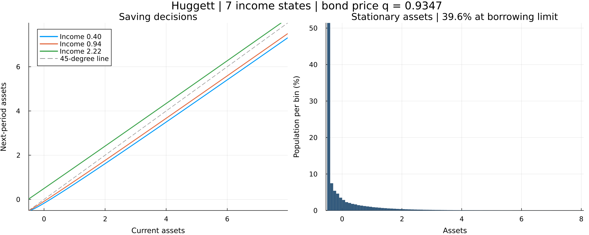

# Huggett: learning and computation

Two Julia implementations of a stationary incomplete-insurance exchange economy:

| Start here | Method | Default policy / distribution nodes |
|---|---|---:|
| [Illustrative](Huggett_illustrative.jl) | Value function iteration, scalar maximization, explicit Young transport | 250 / 1,500 |
| [Efficient](Huggett_efficient.jl) | Endogenous grid method, sparse Young transition, warm starts | 800 / 5,000 |

Both solve the same model. The efficient file imports the illustrative file's
parameters, grid helpers, and price search, so the economic assumptions have
one source. There are no aggregate shocks.

## Run

Dependencies: `Interpolations`, `Optim`, `QuantEcon`, and `Plots`. With those
installed in your Julia environment, run either command from this folder:

```text
julia Huggett_illustrative.jl
julia Huggett_efficient.jl
```

The illustrative version prints the equilibrium. The efficient version also
regenerates **`huggett.png`**, the only figure retained in this folder. Both
scripts also work when called by their full path from another directory.

## Model and income process

Households maximize expected discounted CRRA utility subject to
`c + q*a_next = a + income`, with a borrowing limit of `-0.5`. Bonds are in
zero net supply: their price adjusts until mean assets equal zero.

The defaults are `beta=0.9`, risk aversion `1.5`, and **seven endowment states**.
Rouwenhorst discretizes a log-income AR(1) with persistence `0.9` and
**unconditional** log standard deviation `0.35`; the innovation standard
deviation is `0.35*sqrt(1-0.9^2)`. Income is normalized to have stationary mean
one. The computational asset ceiling is 20. Both grids are denser near the
borrowing limit.

This seven-state process replaces the old two-state example; it is a change
in income risk, not merely extra asset-grid points. This is a teaching
calibration, not a reproduction of Huggett's numerical tables. Changing `nz`
keeps the underlying AR(1) specification fixed:

```julia
include("Huggett_efficient.jl")
using .HuggettEfficient
p = parameters(nz=9, na=800, nd=5000)
result = solve(p)
```

## Algorithms and figure

The illustrative solver follows the Bellman equation directly. The efficient
solver uses the Euler equation `q*u'(c) = beta*E[u'(c_next)]` to construct an
endogenous asset grid, avoiding repeated optimization. Both use Young's
interpolation weights to transport mass, with saving chosen using today's
income before tomorrow's shock arrives. The sparse version precomputes exactly
the same probabilities. Every price search checks excess demand explicitly.



The figure comes from the efficient default. Bars are probabilities in bins
of width 0.1, not a smoothed density; the first bin includes the borrowing-limit
atom. Its approximate mass is reported separately in the title. The horizontal
range ends near the 99.99th asset percentile, while the numerical grid extends
to 20. A smoother tail does not eliminate the economically meaningful atom.

## Numerical checks

At the default efficient grids, `q` is approximately **0.934701**, net assets
are about `1.2e-6`, and the borrowing-limit share is about **39.64%**. Doubling
both grids changes the price by less than `1e-6`. No mass reaches the upper
grid endpoint. Probability, income marginals, market clearing, the goods
resource constraint, Euler/KKT conditions, and an independent household
simulation were checked. The distribution-weighted relative Euler residual
is about `1.9e-6`; the maximum interior residual is about `0.0047`, so the
solution remains a numerical approximation near policy kinks.

In a warm run with identical 250 / 1,500 grids, excluding compilation and
plotting, VFI took approximately **7.58 s**, versus **0.66 s** for the efficient
solver (about **11x faster**). Prices differed by about `2.2e-5`. Timings depend
on the machine; the default efficient figure uses finer grids than this comparison.
Tested with Julia 1.12.2, Interpolations 0.16.2, Optim 1.13.3, QuantEcon 0.17.0,
and Plots 1.41.3.

## References

- [Huggett (1993)](https://doi.org/10.1016/0165-1889(93)90024-M), the exchange economy.
- [Carroll (2006)](https://doi.org/10.1016/j.econlet.2005.09.013), endogenous grids.
- [Young (2010)](https://doi.org/10.1016/j.jedc.2008.11.010), non-stochastic distribution transport.
- [Kopecky and Suen (2010)](https://doi.org/10.1016/j.red.2010.02.002), Rouwenhorst approximation.
